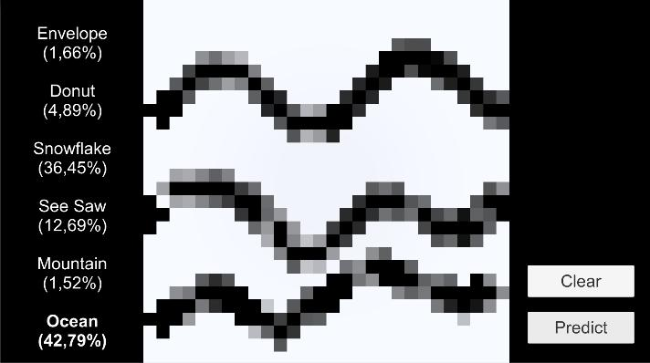

# Konwolucyjne Sieci Neuronowe

Celem projektu jest stworzenie konwolucyjnej sieci neuronowej, umożliwiającej klasyfikację sześciu typów ręcznie rysowanych obiektów, i wykorzystanie jej w aplikacji do rozpoznawania rysunków namalowanych przez użytkownika.

Do wytrenowania sieci neuronowej była wykorzystana baza danych «Qiuck, Draw!» (https://github.com/googlecreativelab/quickdraw-dataset). Z tego zbioru były wybrane następne kategorię:
* envelope,
* donut,
* snowflake,
* see-saw,
* mountain,
* ocean.

Opis projektu i wyniki nauczania sieci są zamieszczone w pliku _raport.pdf_.

Do testowania sieci była napisana aplikacja "Quick, Predict!", którą można pobrać i zainstalować poprzez _QPsetup.exe_.

